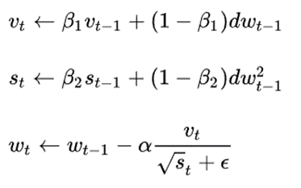
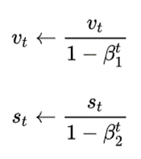

# Лабораторная работа

## 1. Теоретическая база

### Свёртка (convolution)

В свёрточных нейронных сетях свёртка — это операция, при которой фильтр (kernel) скользит по изображению, выделяя признаки.
Формула свёртки:
(f \* g)(t) = ∫ f(τ) g(t - τ) dτ.

#### Процесс свёртки

1. **Фильтр (Kernel)**: Фильтр — это небольшая матрица, которая перемещается по входному изображению. Каждый элемент фильтра умножается на соответствующий элемент изображения, и результаты суммируются, чтобы получить одно значение, которое представляет собой выходное значение для данной позиции.

2. **Скользящее окно**: Фильтр перемещается по изображению с заданным шагом (stride). На каждом шаге происходит вычисление свёртки, что позволяет фильтру охватывать все области изображения.

3. **Паддинг (Padding)**: Для сохранения пространственных размеров выходного изображения часто используется паддинг. Это добавление дополнительных пикселей (обычно нулей) вокруг границ изображения, что позволяет фильтру обрабатывать края изображения.

4. **Активация**: После применения свёртки к изображению, результат может быть передан через функцию активации (например, ReLU), чтобы добавить нелинейность в модель.

5. **Множественные фильтры**: В свёрточных слоях обычно используется несколько фильтров, каждый из которых обучается для извлечения различных признаков (например, края, текстуры и т.д.). Выход каждого фильтра формирует отдельный канал в выходной карте признаков.

### Субдискретизация (pooling)

Субдискретизация — это процесс уменьшения размерности данных, который используется в свёрточных нейронных сетях для снижения вычислительных затрат и уменьшения риска переобучения. Существует несколько методов субдискретизации, наиболее распространённым из которых является макспулинг (max pooling).

#### Макспулинг (Max Pooling)

1Макспулинг — это операция, при которой из окна фиксированного размера выбирается максимальное значение. Это позволяет уменьшить размер карты признаков, сохраняя при этом наиболее значимые характеристики.

**Процесс**:

- **Окно**: Макспулинг применяется к области входных данных, называемой окном (например, 2x2 или 3x3).
- **Скользящее окно**: Окно перемещается по входным данным с заданным шагом (stride). На каждом шаге выбирается максимальное значение из элементов, попадающих в окно.
- **Выход**: Результатом операции является новая карта признаков, где каждое значение соответствует максимальному значению из соответствующего окна входных данных.

**Преимущества**:

- **Снижение размерности**: Макспулинг значительно уменьшает размер карты признаков, что уменьшает количество параметров и вычислительные затраты.
- **Устойчивость к шумам**: Выбор максимального значения помогает сделать модель более устойчивой к шумам и небольшим изменениям в входных данных, что улучшает обобщающую способность модели.

### Dropout

Dropout – метод регуляризации, который заключается в случайном «выключении» (то есть временном исключении из обучения) определенного процента нейронов в сети на каждом шаге обучения. Это означает, что во время каждого прохода обучения (или каждой эпохи) случайно выбранный набор нейронов игнорируется.
Dropout помогает предотвратить чрезмерную зависимость модели от конкретных путей и узлов в сети, что может привести к переобучению. Сначала выбирается вероятность p, с которой каждый нейрон будет исключаться. Обычно p находится в диапазоне от 0.2 до 0.5.

Для каждого слоя, где применяется Dropout, генерируется случайная маска. Эта маска имеет ту же размерность, что и слой, и каждый её элемент является бинарным (0 или 1), где 1 соответствует активации нейрона, а 0 — его отключению. Эта маска генерируется заново для каждого прохода обучения и для каждого обучающего примера. Активации нейронов умножаются на эту маску, эффективно «выключая» некоторые нейроны.
В процессе обратного распространения ошибки, градиенты рассчитываются только для активных нейронов. Нейроны, которые были временно «выключены», не получают обновлений весов.
На этапе предсказания Dropout не работает, маска не используется.

### Batch Normalization

Batch Normalization решает проблему «внутреннего ковариационного сдвига» (Internal Covariate Shift). Этот термин описывает явление, при котором распределение входных данных каждого слоя нейронной сети меняется в процессе обучения, из-за чего сети становится сложнее обучать. Это происходит из-за того, что параметры предыдущих слоев изменяются во время обучения, влияя на данные текущего слоя.

Batch Normalization нормализует выход каждого слоя. Нормализация заключается в преобразовании входных данных каждого слоя таким образом, чтобы среднее значение было приближено к нулю, а стандартное отклонение — к единице. Это делает сеть менее чувствительной к масштабу входных данных и улучшает общую стабильность процесса обучения.

### Оптимизатор Adam

Оптимизатор Adam (Adaptive Moment Estimation) объединяет в себе методы Momentum и RMSProp, практически являясь серебряной пулей в задачах стохастической оптимизации. Как можно заметить, расчёт моментов в Adam очень схож с Momentum и RMSProp за исключением того, что к ним применяется поправка на смещение. В целом, благодаря таким улучшениям Adam сходится быстрее и лучше предшественников, а также более устойчив к подбору гиперпараметров, что делает его более стабильным решением в большинстве случаев.
Алгоритм обновления параметров в Adam и поправка на смещение:




### t-SNE (t-distributed Stochastic Neighbor Embedding)

t-SNE — это метод снижения размерности, который используется для визуализации многомерных данных в двумерном или трехмерном пространстве и группирует похожие точки в кластеры.

#### Принцип работы t-SNE

1. **Сохранение локальной структуры**: t-SNE работает, сохраняя локальную структуру данных. Он пытается минимизировать различия между расстояниями в высокоразмерном пространстве и расстояниями в низкоразмерном пространстве. Это означает, что точки, которые близки друг к другу в исходном пространстве, будут также близки в проекции.

2. **Вероятностная модель**: t-SNE использует вероятностную модель для определения расстояний между точками. В высокоразмерном пространстве для каждой точки вычисляется вероятность того, что другая точка является её соседом. Затем эти вероятности преобразуются в распределение, которое позволяет оценить расстояния в низкоразмерном пространстве.

3. **Оптимизация**: t-SNE использует метод градиентного спуска для оптимизации расположения точек в низкоразмерном пространстве. Цель состоит в том, чтобы минимизировать разницу между распределениями вероятностей в высокоразмерном и низкоразмерном пространствах.

### Матрица неточностей (Confusion Matrix)

Матрица неточностей — это таблица, которая используется для оценки качества классификации модели. Она показывает, как предсказания модели соотносятся с фактическими метками классов.

#### Структура матрицы

Матрица имеет следующую структуру:

```
                            Предсказано положительное       Предсказано отрицательное
Фактическое положительное      TP (True Positive)               FN (False Negative)
Фактическое отрицательное      FP (False Positive)              TN (True Negative)
```

- **TP (True Positive)**: количество верных положительных предсказаний (модель правильно предсказала положительный класс).
- **FP (False Positive)**: количество ложных положительных предсказаний (модель ошибочно предсказала положительный класс).
- **FN (False Negative)**: количество ложных отрицательных предсказаний (модель ошибочно предсказала отрицательный класс).
- **TN (True Negative)**: количество верных отрицательных предсказаний (модель правильно предсказала отрицательный класс).

#### Применение матрицы неточностей

Матрица неточностей позволяет вычислить различные метрики, такие как:

- **Точность (Accuracy)**: (TP + TN) / (TP + TN + FP + FN)
- **Полнота (Recall)**: TP / (TP + FN)
- **Точность (Precision)**: TP / (TP + FP)
- **F1-мера**: 2 _ (Precision _ Recall) / (Precision + Recall)

### ROC-кривая (Receiver Operating Characteristic)

ROC-кривая — это график, который показывает зависимость между истинной положительной долей (TPR) и ложной положительной долей (FPR) при различных порогах классификации.

#### Определения

- **TPR (True Positive Rate)**: также известна как полнота, рассчитывается как TP / (TP + FN).
- **FPR (False Positive Rate)**: рассчитывается как FP / (FP + TN).

#### Применение ROC-кривой

ROC-кривая позволяет визуально оценить производительность модели при различных порогах. Чем ближе к верхнему левому углу находится кривая, тем лучше модель. Площадь под кривой (AUC) измеряет качество классификации: AUC = 1 означает идеальную модель, AUC = 0.5 — случайное предсказание.

## 2. Описание разработанной системы

C - сверточный слой
S - слой субдискретизации (MaxPooling)
F - полносвязный слой

### Модель "LeNet-5"

- **C1**: 6 фильтров размером 5x5.
- **S2**: 6 карт субдискретизации размером 2x2.
- **C3**: 16 фильтров размером 5x5.
- **S4**: 16 карт субдискретизации размером 2x2.
- **C5**: 120 фильтров размером 5x5.
- **F6**: 84 полносвязных нейронов.
- **OUTPUT**: 10 полносвязных нейронов.

### Принципы работы

#### Прямой проход (Forward Pass)

Метод forward реализует прямой проход через сеть. Он последовательно применяет слои к входным данным:

1. Входные данные проходят через первый сверточный слой (conv1), затем через функцию активации leaky_relu, и далее через слой подвыборки (pool1).
2. Аналогично, данные проходят через второй сверточный слой (conv2), функцию активации и слой подвыборки (pool2).
3. Данные преобразуются в одномерный массив перед подачей в полносвязные слои.
4. Каждый полносвязный слой также использует функцию активации leaky_relu, за исключением выходного слоя, который применяет функцию активации softmax для получения вероятностей классов.

#### Обратное распространение ошибки (Backward Pass)

Метод backward реализует обратное распространение ошибки через сеть. Он последовательно вычисляет градиенты для каждого слоя, начиная с выходного слоя:

1. Градиенты потерь, полученные на выходе модели, передаются в метод backward для третьего полносвязного слоя, который вычисляет градиенты для своих весов и смещений на основе входных градиентов. Потом результат умножается на градиент функции активации leaky_relu, применяемой к выходу предыдущего полносвязного слоя при прямом проходе. Далее градиенты передаются для второго полносвязного слоя и процесс повторяется. Затем градиенты передаются в метод backward для первого полносвязного слоя, который также вычисляет градиенты для своих весов и смещений, используя скорректированные входные градиенты.
2. После обработки всех полносвязных слоев, градиенты преобразуются в форму, необходимую для сверточных слоев. В данном случае они принимают размерность, соответствующую выходу после сверток и подвыборок.
3. Градиенты передаются в для слоя подвыборки, который вычисляет градиенты для входных данных, используя восстановленные градиенты и входные данные этого слоя. Это позволяет учитывать, как подвыборка влияет на градиенты. Затем градиенты умножаются на градиент функции активации leaky_relu, применяемой к выходу второго сверточного слоя. Это учитывает влияние активации на градиенты, и затем они передаются в сверточный слой для вычисления градиентов по отношению к фильтрам. Процесс повторяется для всех блоков в обратном порядке.
4. Метод возвращает окончательные градиенты, которые используются для обновления весов модели в методе update_params.

### Другие модели

#### Первая модель

Добавлен Adam оптимизатор и батчнормализация после последнего полносвязного слоя.

#### Вторая модель

Добавлен дропаут (p=0.3) каждого слоя свертки и макспулинга. На свертках добавлен паддинг (1).

Количество фильтров: на первой свертке - 16, на второй - 32.

В свертке оба ядра поменяли на 3x3.

#### Третья модель

Дропаут (p=0.5) перенесли на полносвязные слои, паддинг на свертках убрали, добавили батчнормализацию после каждого слоя свертки.

В первой свертке ядро 3x3, во второй - 5x5.

### Финальная модель

Для дропаута p=0.3.

### Используемые библиотеки

- numpy
- matplotlib
- sklearn
- seaborn

## 3. Результаты тестов

1. LeNet-5

Macro average metrics:
Precision: 0.8799
Recall: 0.8744
F1-score: 0.8749
AUC: 0.9891

Weighted average metrics:
Precision: 0.8807
Recall: 0.8764
F1-score: 0.8763

2. Первая модель

Macro average metrics:
Precision: 0.9429
Recall: 0.9433
F1-score: 0.9428
AUC: 0.9973

Weighted average metrics:
Precision: 0.9438
Recall: 0.9436
F1-score: 0.9434

3. Вторая модель

Macro average metrics:
Precision: 0.9387
Recall: 0.9389
F1-score: 0.9386
AUC: 0.9969

Weighted average metrics:
Precision: 0.9396
Recall: 0.9392
F1-score: 0.9392

4. Третья модель

Macro average metrics:
Precision: 0.9469
Recall: 0.9469
F1-score: 0.9468
AUC: 0.9964

Weighted average metrics:
Precision: 0.9474
Recall: 0.9472
F1-score: 0.9472

5. Финальная модель

Macro average metrics:
Precision: 0.9469
Recall: 0.9469
F1-score: 0.9468
AUC: 0.9964

Weighted average metrics:
Precision: 0.9474
Recall: 0.9472
F1-score: 0.9472

### Закономерности

1. Adam-оптимизатор и батчнормализация после последнего полносвязного слоя значительно улучшают результаты.
2. Увеличение количества фильтров на свертках улучшает результаты.
3. Сильный коэфициент дропаута ухудшает результаты.

#### Наиболее трудноразспознаваемые цифры

- 4 (9)
- 3 (8)
